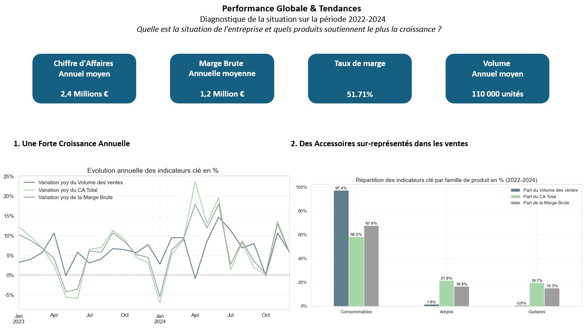
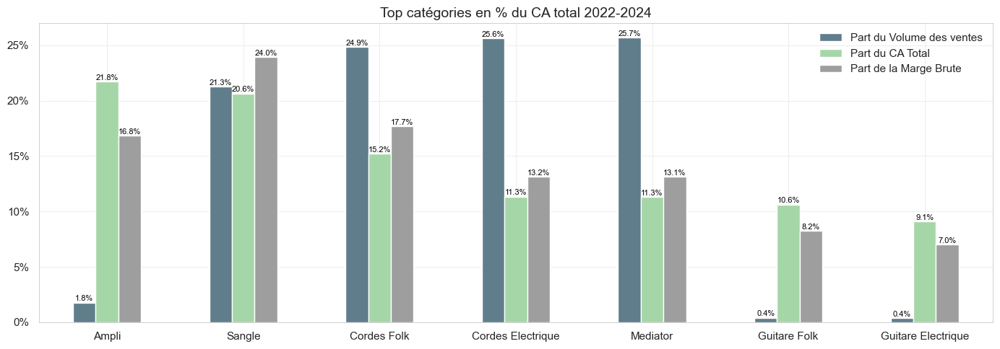
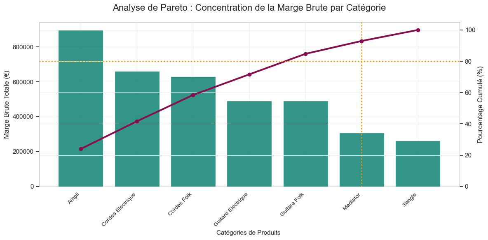
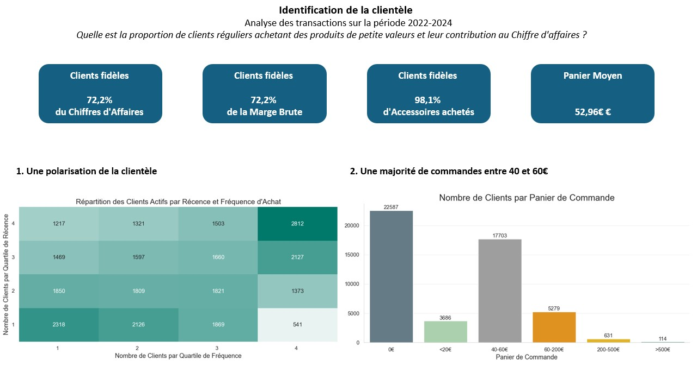
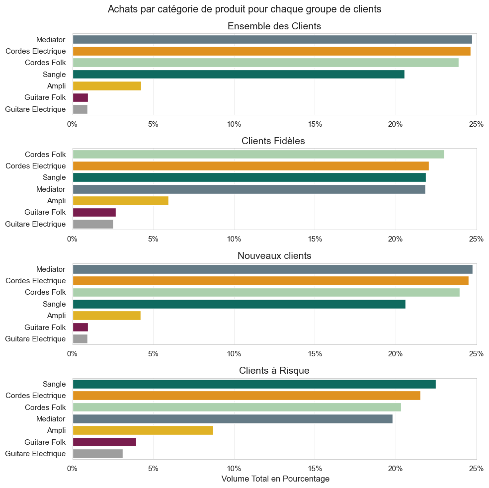
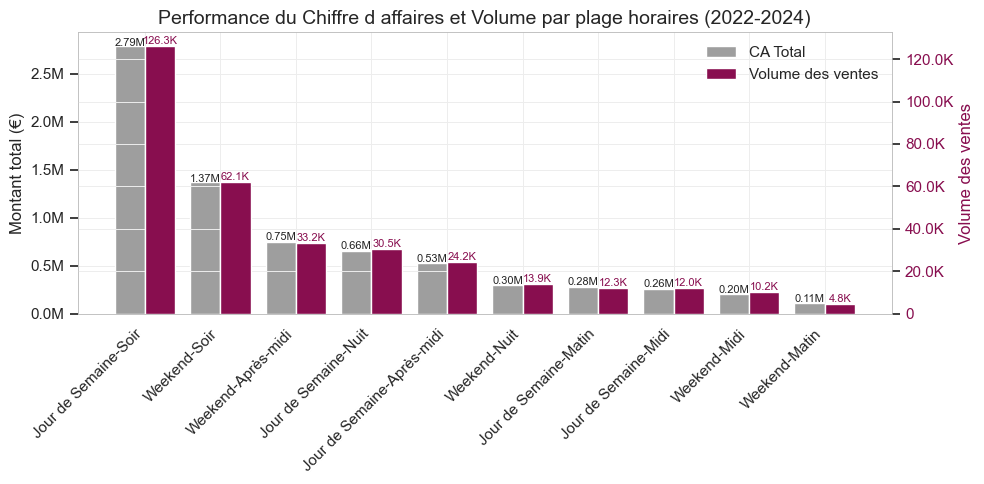
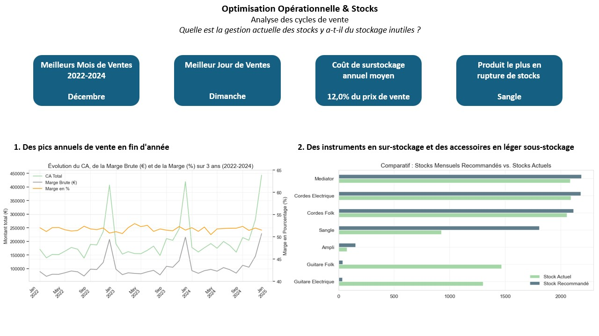
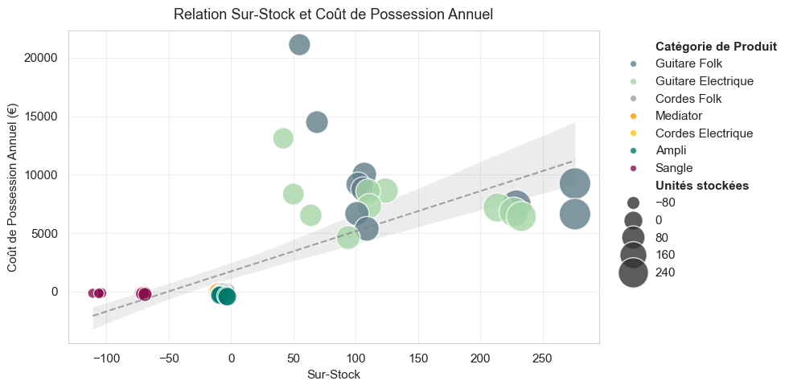
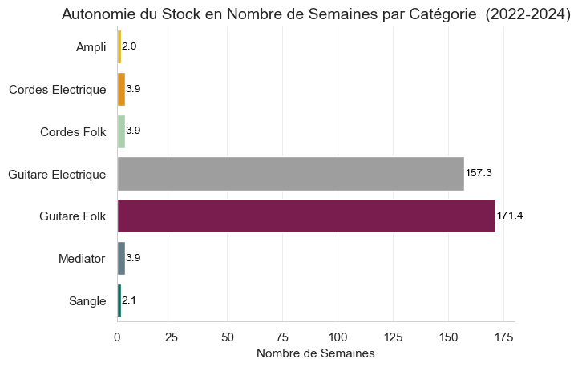

# __Le Comptoir du Guitariste — Analytise, Rentabilité & Optimisation des Stocks__
## Tech Stack

SQL (PostgreSQL) • Python • Pandas • NumPy • Matplotlib • Seaborn • Jupyter
 CTE • Window Functions • RFM • Pareto • Data Cleaning • DataViz

# Table des Matières 
* [1. Contexte & Objectifs du Projet](#1-contexte--objectifs-du-projet)
* [2. Données Utilisées](#2-données-utilisées)
* [3. Nettoyage & Préparation (SQL)](#3-nettoyage--préparation-sql)
* [4. Analyse (Python)](#4-analyse-python)
* [5. Visualisations et Analyse](#5-visualisations-et-analyse)
    * [1. Performance Globale des Ventes](#1-performance-globale-des-ventes)
        * [a. Produits les plus performants](#a-produits-les-plus-performants)
        * [b. 10 meilleurs mois en Chiffre d'Affaires](#b-10-meilleurs-mois-en-chiffre-daffaires-2022-2024)
        * [c. Loi de Pareto 80/20](#loi-de-pareto)
    * [2. Clients](#2clients)
        * [a. Panier moyen par type de client](#a-panier-moyen-par-type-de-client)
        * [b. Distribution des ventes par plages horaires](#b-distribution-des-ventes-par-plages-horaires-semaine-vs-week-end)
    * [3. Gestion des Stocks](#3gestion-des-stocks)
        * [a. Impact du sur-stock sur la marge](#a-impact-du-sur-stock-sur-la-marge)
        * [b. Durée d'autonomie du stock mensuel](#b-durée-dautonomie-du-stock-mensuel)
* [6. Insights & Findings (principaux résultats)](#6-insights--findings-principaux-résultats)
* [7. Recommandations Business](#7-recommandations-business)

## 1. Contexte 
Le Comptoir du Guitariste est une boutique e-commerce fictive spécialisée dans la vente de guitares et accessoires liés.
Malgré un volume de ventes solide et une marge brute confortable, la rentabilité globale s'est détériorée. L'objectif est d'identifier les leviers financiers et opérationnels (ventes, clients, stocks) responsables de cette dégradation sur la période 01/01/2022-31/12/2024.


## 2. Données Utilisées
Les données proviennent de 5 sources internes simulées :
- fact_ventes: liste des 136 000 transactions
- dim_produits : inventaire des 70 références produit
- stock_actuel : liste du stock mensuel actuel par référence
- dim_clients : liste des 50 000 clients inscrits sur le site en ligne
- dim_dates : liste de tous les jours et de leurs informations sur la période 2022-2024

## 3. Nettoyage & Préparation (SQL)
Le nettoyage a été réalisé principalement en SQL, avant transformation et visualisation dans Python.

✔️ Principales opérations réalisées
- Normalisation des formats (dates, numériques, prix)
- Traitement des valeurs manquantes (COALESCE, NULLIF)
- Harmonisation des catégories produits
- Joins complexes entre transactions, produits, stocks et clients
- Agrégations multi-niveaux (catégorie, client, mois)
- Création de vues intermédiaires pour simplifier les analyses

✔️ Fonctions SQL utilisées
- CTE (WITH …)
- Window functions (LAG, RANK, NTILE, OVER(PARTITION BY…)
- CASE WHEN
- GROUP BY / HAVING
- Indexation & optimisation des requêtes

✔️ Exemples de variables dérivées créées
- Variation MoM et YoY
- Stock recommandé
- Score Recency/Frequency
- Coût de possession du stock
- Identification sur-stock
- Prix moyen, panier moyen, marge cumulée

Exemple de requête SQL utilisée: 
``` sql
-- Calcul des Scores Recence et Frequence
WITH RF AS (
    SELECT 
            dim_clients.client_id,
            --Dernière transaction de chaque client (Recence):
            '2024-12-31' - MAX(fact_ventes.date_transaction) AS jours_depuis_derniere_transaction,
            -- Nombre de transactions effectuées par client (Frequence):
            COUNT(fact_ventes.date_transaction) AS nombre_transactions
                   
    FROM dim_clients
    LEFT JOIN fact_ventes
        ON fact_ventes.client_id = dim_clients.client_id
    GROUP BY dim_clients.client_id
),
scores AS (
	SELECT 
		client_id,
		-- On divise la recence en quartiles en mettant en Q1 les plus grandes valeurs (recences les plus faibles ):
		NTILE(4) OVER( ORDER BY(jours_depuis_derniere_transaction) DESC) AS score_recency,
				-- On divise la fréquence en quartiles en mettant en Q1 les plus petites valeurs (fréquences les plus faibles):
		NTILE(4) OVER( ORDER BY(nombre_transactions) ASC) AS score_frequency
	FROM RF
)
--Classement des clients 
SELECT 
	client_id,
	score_recency,
	score_frequency
FROM scores
ORDER BY client_id ASC
;
```

(Source : [1.segments_clients](1.Donnees/2.Requetes_SQL/2.analyse_client/1.segments_clients.sql) )

## 4. Analyse (Python)
Les analyses ont été finalisées en Python, après export SQL au format csv. Bien que ce ne soit pas le meilleur format dans la pratique de marché, ce choix simplifiait les transferts de données pour cette analyse.  

✔️ Bibliothèques utilisées

``` python   
import pandas as pd
import numpy as np
import seaborn as sns
import matplotlib.pyplot as plt
```
✔️ Transformations Python réalisées
- Nettoyage final et typage (astype, str.replace, fillna)
- GroupBy multi-index
- Pareto (calcul du cumul, cumsum())
- Visualisations personnalisées
- Mise en place d'une palette harmonisée


Exemple de code Python utilisé:
```python 
# CALCUL DE LA SOMME CUMULATIVE DE LA MARGE POUR L'ANALYSE DE PARETO:

df_pareto.sort_values(by='pct_marge_globale', ascending =False, inplace = True)

# Regroupement par catégorie : 
df_marge_categorie = df_pareto.groupby('categorie')['marge_brute'].sum().reset_index()

# Total global : 
total_marge = df_pareto['marge_brute'].sum()

# Pct marge globale par catégorie :
df_marge_categorie['pct_marge_globale'] =  df_marge_categorie['marge_brute']/total_marge
df_marge_categorie.set_index('categorie')

df_marge_categorie = df_marge_categorie.sort_values(by = 'pct_marge_globale' , ascending = False)

# Somme cumulative
df_marge_categorie['cumul_marge_pct']= df_marge_categorie['pct_marge_globale'].cumsum().sort_values(ascending = False)

```
(Source : [2.Produits](2.Notebooks/2.Produits.ipynb))  

## 5. Visualisations et Analyse

### __1. Performance Globale des Ventes__


- Le Chiffre d'affaire et le volume augmentent respectivement de 12,1% et de 12,5% sur la période 2022-2024. 
- Les ventes ont particulièrement été impactées par la baisse du chiffre d'affaires de 7,1% en Janvier 2024, malgré une augmentation du volume vendu de 2,8%. Les clients se sont tournés vers plus de produits, mais de plus faible valeur qu'en Janvier 2023 (cordes ou médiators).

- En Avril 2024, les ventes ont bondi de 23,65% vs Avril 2023 malgré un volume en légère baisse (-0,9%), indiquant une préférence pour des produits plus chers mais en plus petite quantité (instruments ou amplis) par rapport à l'année précédente.

- Les amplis et guitares, bien que représentant 2,6% du volume vendu, représentent 40,5% du chiffre d'affaire réalisé et 31,8% de la marge brute. Le prix unitaire plus élevé compense les volumes plus faibles de ventes.

_Sources :_ 
- _[Notebook 1](2.Notebooks/1.Vue_globale_3ans.ipynb)_
- _[Notebook 2.a](2.Notebooks/2.Produits.ipynb)_

#### __a. Produits les plus performants__



Les ventes sont soutenues par les accessoires, bien que le prix unitaire des instruments leur permette de générer 19,7% du chiffre d'affaires. 

Code python utilisé :
``` python 
df_top_CA_pct. plot(kind='bar', figsize=(14, 5))

plt.tight_layout() 
plt.show()

```
_Source : [Notebook 2.b.](2.Notebooks/2.Produits.ipynb)_

#### __b. 10 meilleurs mois en Chiffre d'Affaires (2022-2024)__


- Les 10 mois de vente les plus importants pour le Comptoir du Guitariste sont situés sur le quatrième trimestre sur les trois années consécutives. La rentrée scolaire de Septembre, le Black Friday en Novembre et les fêtes de fin d'année représentent une période de choix pour les achats liés aux loisirs.  

_Source : [Notebook 4.b](2.Notebooks/4.Saisonnalité.ipynb)_

#### __c. Loi de Pareto 80/20 : s'applique -t-elle ici ?__


-  La loi de Pareto 80/20 ne s'applique pas : 71% des produits génèrent 84% de la marge brute. 
La distribution de la marge est plus égalitaire, indiquant qu'une rupture sur un seul produit aura moins d'impact que dans la loi de Pareto classique (80/20) .
- Cependant la marge brute est fortement corrélée à la performance des amplis et cordes, qui sont ses principaux contributeurs (environ 60% de la marge brute globale). 

- La gestion des Amplis, Cordes Électriques, Cordes Folk (top 3 contributeurs à la marge) doit être la plus optimisée afin d'éviter tout impact disproportionné sur la rentabilité globale.

_Source : [Notebook 2.e](2.Notebooks/2.Produits.ipynb)_

### __2.Clients__

 

- 54,8% des clients ont réalisé au moins un achat et sont donc considérés comme actifs.
Les clients les plus fidèles sont localisés dans le haut droit de la matrice (récence et fréquence d'achat élevées) et représentent 16,2% de la clientèle active. 

- 13,7% des clients actifs sont des acheteurs peu fréquents et un tiers d'entre eux ont effectué leur achat il y a longtemps. Cela peut être lié à des clients insatisfaits du service ou des acheteurs de produits onéreux et durables. Le double score récence/ fréquence de 1/1 indique que ces clients sont probablement perdus. 

- 45,2% des clients enregistrés n'ont pas effectué d'achat. Ils peuvent avoir créé un compte sur le site en ligne, enregistré un panier d'achat ou être abonné à la newsletter. 

_Sources :_
- _[Notebook 3.a](2.Notebooks/3.Clients.ipynb)_
- _[Notebook 3.c](2.Notebooks/3.Clients.ipynb)_


#### __a. Panier moyen par type de client__



- Les produits les plus achetés par l'ensemble des clients sont les médiators et les cordes de guitare, qui doivent être renouvelé régulièrement et sont sont accessibles au plus grand nombre (<25€). Ce sont également les produits d'entrée pour les nouveaux clients.

- Les clients à risque sont définis par un score RFM (Récence, Fréquence, Chiffre d'affaire généré) compris entre 222 et 332. Ce sont des clients qui achètent principalement des accessoires mais peu fréquemment et pas récemment. Ils peuvent être des amateurs qui ne consomment pas beaucoup de matériel, avoir arrêté la pratique de la guitare ou avoir choisi un autre fournisseur. Ils sont 16 807 à appartenir à cette catégorie

_Source : [Notebook 3.d](2.Notebooks/3.Clients.ipynb)_
#### __b. Distribution des ventes par plages horaires (semaine vs week-end)__


- Les clients achètent sur leur temps libre et lorsqu'ils sont chez eux. Les moments les plus propices à l'achat sont donc le soir, suivi du week-end après-midi. Ce sont les plages horaires à privilégier pour lancer les promotions et campagnes publicitaires, mais également celles qui nécessitent le plus de ressources. 

_Source : [Notebook 4.d](2.Notebooks/4.Saisonnalité.ipynb)_

### __3.Gestion des Stocks__


- Il y a une cyclicité annuelle claire, avec des pics localisés sur le troisième trimestre, principalement en Décembre (corroboré avec l'analyse en 1.b. ([Voir ici](#b-10-meilleurs-mois-en-chiffre-daffaires-2022-2024))), et un léger creux en Août-Septembre, expliqué par le ralentissement global annuel lié aux vacances scolaires à cette période. 

- Les stocks pourraient être optimisés, notamment pour les instruments, qui mobilisent beaucoup de capital (coût moyen d'acquisition de 500,0€ pour l'entreprise). A l'inverse, on observe du sous-stockage sur les accessoires les plus vendus.

_Sources :_
- _[Notebook 4.a](2.Notebooks/4.Saisonnalité.ipynb)_
- _[Notebook 5.d](2.Notebooks/5.optimisation_stocks.ipynb)_

#### __a. Impact du sur-stock sur la marge__



- Ce graphique nous permet d'avoir une meilleure vue des coûts engendrés par le sur-stockage. Les coûts de possessions sont définis par la formule suivante avec un taux de possession annuel fixé à 20% : 
$$\text{Coût de Possession Annuel} = \text{Sur-stock} \, \times \, \text{Coût Unitaire} \, \times \, \text{Taux de Possession Annuel}$$

_Source : [Notebook 5.c](2.Notebooks/5.optimisation_stocks.ipynb)_

#### __b. Durée d'autonomie du stock mensuel__



- La mauvaise répartition des stocks engendre une asymétrie dans le besoin de réapprovisionnement et demande un suivi pour chaque catégorie, accaparant du personnel, du temps et de l'argent. On constate les ruptures de stocks inévitables sur les amplis et sangles qui n'ont que deux semaines d'autonomie alors que les guitares affichent un _stock cover_ de 160 semaines (plus de trois ans), signalant un risque majeur de perte de valeur et d'immobilisation de capital. 

_Source : [Notebook 5.b](2.Notebooks/5.optimisation_stocks.ipynb)_

## 6. Insights & Findings (principaux résultats)
### 📌 1. Forte saisonnalité
Chaque année le mois de Décembre performe au-dessus de la moyenne annuelle (+120%).C’est le vrai moteur du chiffre d'affaires annuel et une période clé pour la pérennité de l'entreprise.

### 📌 2. Distribution de la marge équilibrée
L'activité repose sur les ventes de 51 produits sur 70. Cette distribution large de la marge impose de s'assurer de stocks en conséquences sur ces 51 produits (amplis, cordes et guitares). 

Les 29% de produits les moins performants (sangles et médiators) jouent le rôle de produit d'entrée pour les nouveaux clients et assurent des volumes de ventes constants. 

### 📌 3. Ruptures fréquentes sur les best-sellers
Les produits les plus vendus sont également ceux qui souffrent le plus de ruptures de stocks (amplis, sangles, médiators et cordes).

### 📌 4. Sur-stock sur certains modèles haut de gamme
A l'inverse, les guitares, qui sont les produits les moins vendus, possèdent un stock excessif, qui impacte négativement le cash-flow en immobilisant de la trésorerie et en générant des coûts de possession.

### 📌 5. Clients fidèles, moteur de l'activité
Les clients fidèles constituent une base solide et conséquente pour l'activité de l'entreprise, générant 72,2% du chiffre d'affaires et de la marge brute. Ces clients commandent à 98,1% des accessoires.

On notera également un taux de rétention des nouveaux clients très performant de 87,59%.


## 7. Recommandations Business

### 1. Gestion des stocks :
#### Optimiser l’assortiment
- Réduire le volume de stock sur les guitares : 

Il est nécessaire d'écouler le stock actuel sans le réapprovisionner ou de vendre le surstock pour limiter les coûts de possession qui s'étaleraient sur trois années.

- Concentrer les achats sur les accessoires : 

Les sangles et les amplis, sont en sous-stock important et nécessitent un réajustement urgent des stocks. 

Dans un second temps, les médiators et cordes nécessiteront également une augmentation de leurs stocks.

#### Mettre en place un système prédictif simple
- Prévisions de demande :

Les cycles annuels révèlent une forte augmentation des ventes sur le quatrième trimestre. Il faudra anticiper de possibles rupture chez les fournisseurs à cette période et prévoir en amont une augmentation des stocks pour compenser. 

- Stock de sécurité : 

Définir un stock de sécurité par catégorie permettrait de garantir une disponibilité continue le temps de la réception des commandes.   

#### Définir des KPI récurrents pour piloter le stock :
- Stock coverage : 

Mesure le nombre de semaines pendant lesquels le stock actuel peut couvrir la demande moyenne future sans réapprovisionnement. Il faudrait définir un nombre de jour minimum de couverture. 
$$
\text{Taux de Couverture (en semaines)} = \frac{\text{Stock Actuel}}{\text{Ventes Moyennes Hebdomadaires}}
$$

- Taux de Rotation : 

Mesure le nombre de fois où le stock moyen a été vendu et remplacé pendant une période donnée.
Si ce taux est faible pour les guitares, cela confirme que le capital y est immobilisé trop longtemps.
$$
\text{Taux de Rotation} = \frac{\text{Coût des Marchandises Vendues (CMV)}}{\text{Valeur du Stock Moyen}}
$$

### 2. Améliorer la stratégie clients
#### Relancer le segment clients à risque :

Les clients qui achètent à basse fréquence pourraient être fidélisés par des promotions ou des produits exclusifs. Des campagnes publicitaires annuelles ou semestrielles ciblées pourraient les inciter d'avantage à consommer.

#### Fidéliser les clients les plus fidèles :

Ces clients sont le moteurs de la croissance de l'entreprise et doivent donc être satisfaits pour revenir d'année en année. Concevoir un programme de fidélisation par cumul de points ou des offres promotionnelles spéciales contribuerait à les conserver. 

#### Développer les plages horaires:

Les moments les plus propices à la vente sont le soir et le week-end après-midi. Deux options sont possible pour les optimiser.
1. Amplifier les plages horaires clés pour maximiser le chiffre d'affaires et la satisfaction client. La rentabilité devrait augmenter rapidement, mais la demande plafonnera après un certain temps et les ressources seront utilisées de manière intensive sur ces plages horaires. Cette option capitalise sur un succès prouvé et est la plus certaine. 

2. Développer les plages horaires creuses pour lisser la demande et gagner de nouveaux clients. Cette stratégie optimise l'utilisation des ressources et permet des gains de parts de marché, mais requiert des coûts marketing pour un résultat incertain. Cette option est intéressante à moyen terme pour lisser la charge et l'utilisation du capital.

